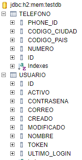

# Getting Started

### Reference Documentation
For further reference, please consider the following sections:

* [Official Gradle documentation](https://docs.gradle.org)
* [Spring Boot Gradle Plugin Reference Guide](https://docs.spring.io/spring-boot/docs/2.5.4/gradle-plugin/reference/html/)

### Repository

To download from the repository run the following command:

git clone https://github.com/lvilchesb/special-integration-bl.git

# Compile and Run

Remember to compile in Java 8 or higher, and execute the following command

./gradlew clean build

And then you must execute the following command for run the application

./gradlew bootRun --args='--spring.profiles.active=local'

# URL´s Y BODY para pruebas

* Utilizar herramienta postman para probar las apis.

POST: http://localhost:8080/whole/postsale
BODY:
{
    "nombre": "Juan Rodriguez",
    "correo": "jaauan@rodriguez.cl",
    "contrasena": "Qhunter2",
    "activo": "true",
    "telefonos": [
        {
            "numero": "1234567",
            "codigoCiudad": "1",
            "codigoPais": "57"
        },
         {
            "numero": "123",
            "codigoCiudad": "1",
            "codigoPais": "57"
        }
    ]
}

PUT: http://localhost:8080/whole/putsale
BODY:
{
    "id": 1,
    "nombre": "Juan Rodriguez",
    "correo": "jaauan@rodriguez.cl",
    "contrasena": "Hhunter6",
    "telefonos": [
        {
            "phoneId": 1,
            "numero": "4444",
            "codigoCiudad": "1",
            "codigoPais": "57",
            "usuario": 1
        },
        {
            "phoneId": 2,
            "numero": "44",
            "codigoCiudad": "1",
            "codigoPais": "57",
            "usuario": 1
        }
    ],
    "activo": "true o false"
}

GET: http://localhost:8080/whole/getsale
BODY:
{
    "correo": "jaauan@rodriguez.cl"
}

DELETE: http://localhost:8080/whole/deletesale
BODY:
{
    "correo": "jaauan@rodriguez.cl"
}

BASE DE DATOS:

URL: http://localhost:8080/h2-console/login.jsp?jsessionid=9f446ffd5213bfbdb518a1c0917a0a91

# Datos de conexión
Saved Settting: Generic H2 (Embedded)
Setting Name: Generic H2 (Embedded)
Driver Class: org.h2.Driver
JDBC URL: jdbc:h2:mem:testdb
User Name: sa
Password: password

